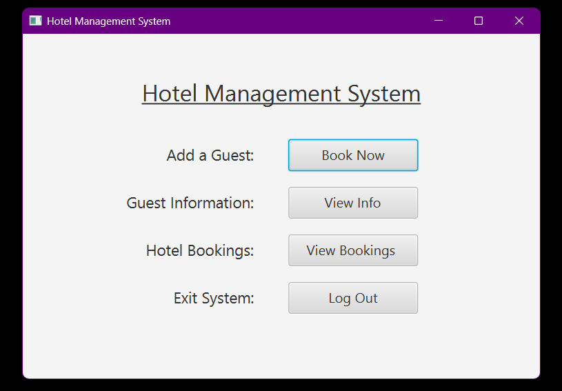
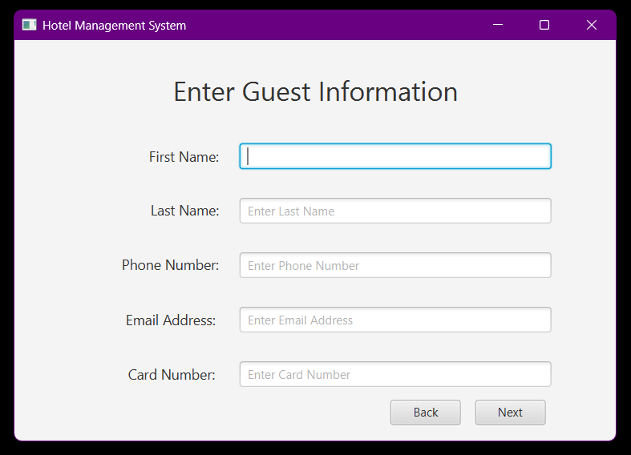
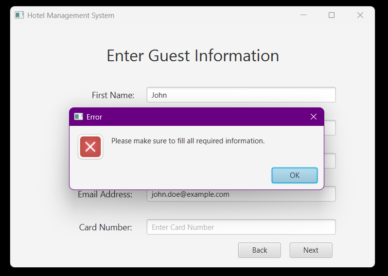
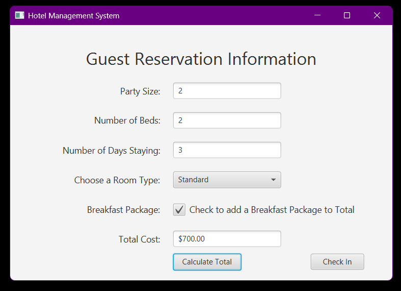
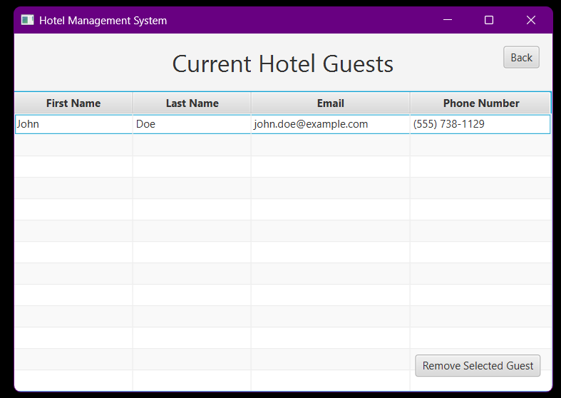
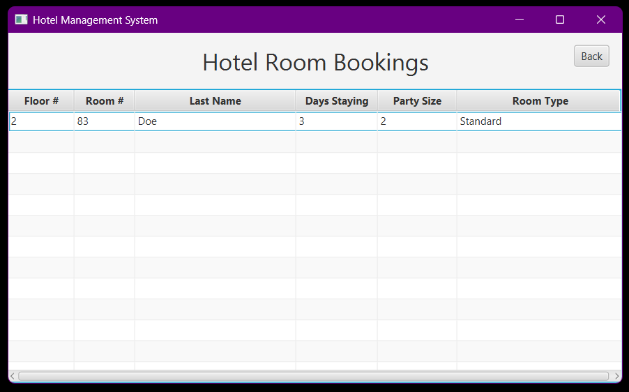

# 🏨 Hotel Management System

This project is a **Hotel Management System** developed as a final project for an Object-Oriented Programming (OOP) course. It provides a basic but functional interface for managing hotel guests and their reservations. The application was developed over the course of one month by a team of four students, including myself, and was presented live in front of the class, earning a final grade of **99**.

## 💡 Features

- Add hotel guest information
- Make reservations with differing room types (Standard, Balcony, Handicap Accessible)
- Optional breakfast package added to reservation
- Total cost calculator prior to reservation check in
- View a table of all current guests and their reservation details
- Remove guests and their corresponding reservations with ease
- Close the program via a logout button
- GUI built with **JavaFX** using **SceneBuilder**
- **Error handling** using JavaFX `Alert` popups for invalid input or missing data
- Data is managed at runtime only (not persisted to file or database)
- Note: This project is a prototype and was not designed for deployment

## 🛠 Technologies Used

- **Java** (via IntelliJ IDEA)
- **JavaFX** (for GUI functionality)
- **SceneBuilder** (for designing FXML UI)
- **Object-Oriented Programming** principles

## 👥 Team & Roles

- **4-person group project**
- Regular group meetings for collaboration and progress tracking
- **My Role**:
  - Designed and implemented all FXML files using SceneBuilder
  - Developed controller classes for UI interaction
  - Debugged and refined the Java logic and object structure

## 🔍 Object-Oriented Design

- **Inheritance**  
  The `Rooms` superclass has three subclasses representing room types:
  - `StandardRoom`
  - `BalconyRoom`
  - `HandicapAccessibleRoom`

- **Polymorphism**  
  The system interacts with different room types through the shared `Rooms` superclass. This allows methods that handle generic `Rooms` to seamlessly work with any specific room type, demonstrating **runtime polymorphism**.

- **Other Classes**:
  - `HotelGuestInformation`: stores guest information
  - `HotelGuestReservation`: stores reservation details
 
## 📁 Running the Project

1. Open the project in **IntelliJ IDEA**
2. Ensure **JavaFX** is properly set up
3. Run the `HotelManagement` class
4. Use the GUI to interact with the hotel management system

## 📸 Screenshots

### Hotel Home Page

### Add Guest Form

### One Example of Error Handling

### Guest Reservation Form

### Table View of Guests and Reservations

---
